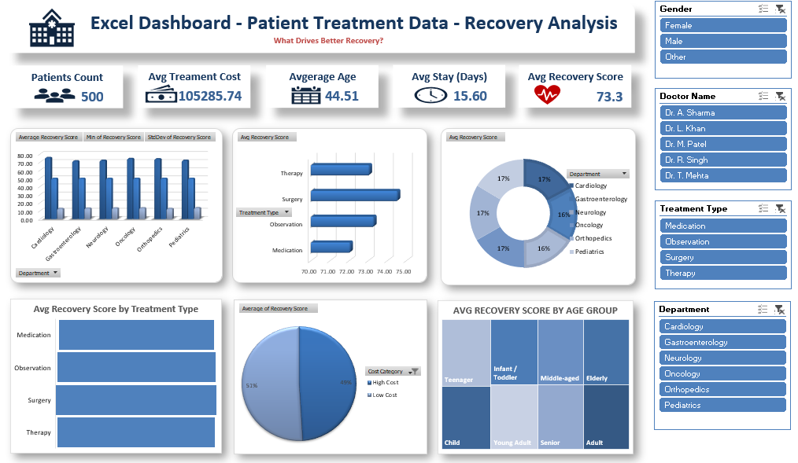

# 🏥 Hospital Patient Analytics — End-to-End Project

🔗 **[Live Dashboard](https://hospital-patient-analytics-end-to-end-project-ogw6wljrrqids4tp.streamlit.app/)**

An end-to-end data analytics project on hospital patient data, built across **four different tools** to showcase the same analysis from database to dashboard: **SQL**, **Excel**, **Power BI**, and **Python (Streamlit)**.

The dataset contains 500 synthetic patient records covering department, treatment type, doctor, demographics, treatment cost, hospital stay duration, and recovery outcomes.

---

## 📁 Project Structure

- [`SQL_Analysis.sql`](SQL_Analysis.sql)
- [`Excel_Dashboard.xlsx`](Excel_Dashboard.xlsx)
- [`PowerBI_Project/`](PowerBI_Project)
  - [`PowerBI_Dashboard.pbix`](PowerBI_Project/PowerBI_Dashboard.pbix)
  - [`PowerBI_screenshot.png`](PowerBI_Project/PowerBI_screenshot.png)
- [`Python_Dashboard/`](Python_Dashboard)
  - [`app.py`](Python_Dashboard/app.py)
  - [`patients.csv`](Python_Dashboard/patients.csv)
  - [`requirements.txt`](Python_Dashboard/requirements.txt)

| File / Folder | Tool | Description |
|---|---|---|
| `SQL_Analysis.sql` | SQL | Database schema, data, and analysis queries (KPIs, group-by charts) |
| `Excel_Dashboard.xlsx` | Excel | Pivot tables, pivot charts, and a summary dashboard |
| `PowerBI_Dashboard.pbix` | Power BI | Interactive Power BI report with the same KPIs/visuals |
| `Python_Dashboard/app.py` | Python | Interactive Streamlit web dashboard |
| `Python_Dashboard/patients.csv` | Python | Source data used by `app.py` |
| `Python_Dashboard/requirements.txt` | Python | Python libraries needed to run `app.py` |

---

## 📊 Dataset Overview

- **500 patient records**
- **Departments:** Cardiology, Neurology, Oncology, Orthopedics, Pediatrics, Gastroenterology
- **Treatment types:** Medication, Therapy, Surgery, Observation
- **Fields:** patient_id, department, treatment_type, doctor_name, gender, age, treatment_cost, hospital_stay_days, recovery_score, cost_category, age_group

## 📈 KPIs & Visuals (consistent across all four versions)

- Total Patients
- Average Treatment Cost
- Average Age
- Average Hospital Stay (Days)
- Average Recovery Score
- Avg Recovery Score by Department
- Avg Recovery Score by Treatment Type
- Gender Distribution
- Cost Category Distribution
- Avg Recovery Score by Age Group
- Avg Treatment Cost by Department

---

## ▶️ How to Run Each Version

### 1. SQL — [`SQL_Analysis.sql`](SQL_Analysis.sql)
Open in any MySQL/SQL Server client. It creates the database and table, inserts all 500 records, and includes ready-to-run analysis queries for each KPI/chart.

### 2. Excel — `Excel_Dashboard.xlsx`
Open in Microsoft Excel. Data is in the `Patient_Data` sheet; KPIs, pivot charts, and the summary dashboard are in the other sheets.

### 3. Power BI — `PowerBI_Dashboard.pbix`
Open in Power BI Desktop (free download from Microsoft) to view the interactive report.

### 4. Python (Streamlit) — `Python_Dashboard/` 🔗 **[Live Dashboard](https://hospital-patient-analytics-end-to-end-project-ogw6wljrrqids4tp.streamlit.app/)**

---

## 🛠️ Tech Stack

`SQL` · `Microsoft Excel` · `Power BI` · `Python` · `Streamlit` · `Pandas` · `Plotly`

---

## ✍️ Author

Ashima Pradhan
